# Fase 1: Preparación del entorno de desarrollo

---

## 1.1. Crear el módulo y replicar el código base

1. **Crear Rama:** En la instancia de Odoo.sh, crear una nueva rama de desarrollo. En este caso usaremos:  `integracion_simple_api`.

   

2. En la sección "Development" a la izquierda, aseguramos que esté seleccionada la rama `main`.

   

3. En el campo de texto de abajo que dice "To New branch name...", escribimos el nombre de la nueva rama: **`integracion_simple_api`**.

   

4. Presionamos el botón para crearla.

- Odoo.sh crea la nueva rama en tu repositorio de GitHub por ti.
- Inmediatamente, empieza a crear un nuevo "Build de Desarrollo" para esa rama.

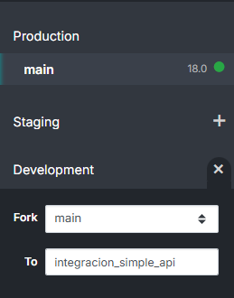

- Esperamos que termine de hacer el build:

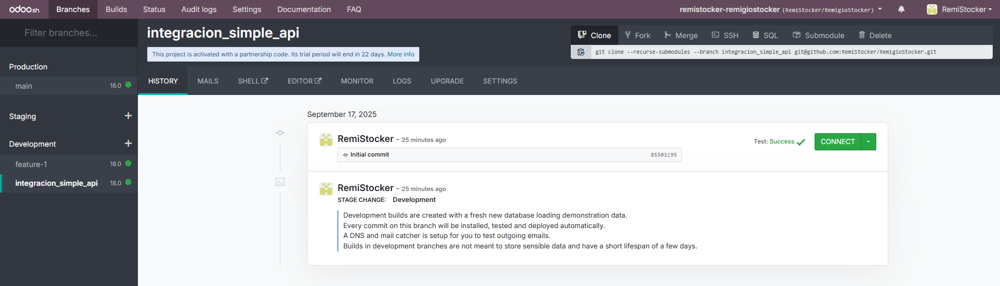

Ahora que el entorno está preparado, el siguiente paso del plan es abrir la **Shell** y comenzar a configurar los archivos de tu módulo dentro de esta rama.

---

### Creamos la estructura inicial en la shell 

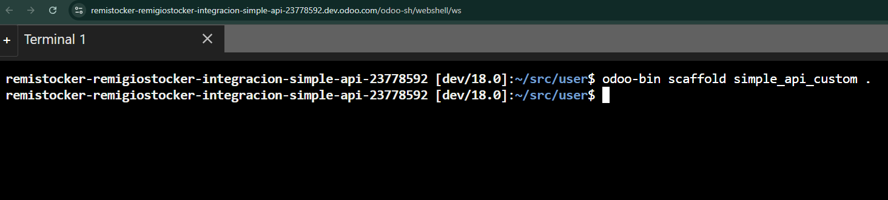

En el editor de código copiamos el código del modulo proporcionado en `src/user`

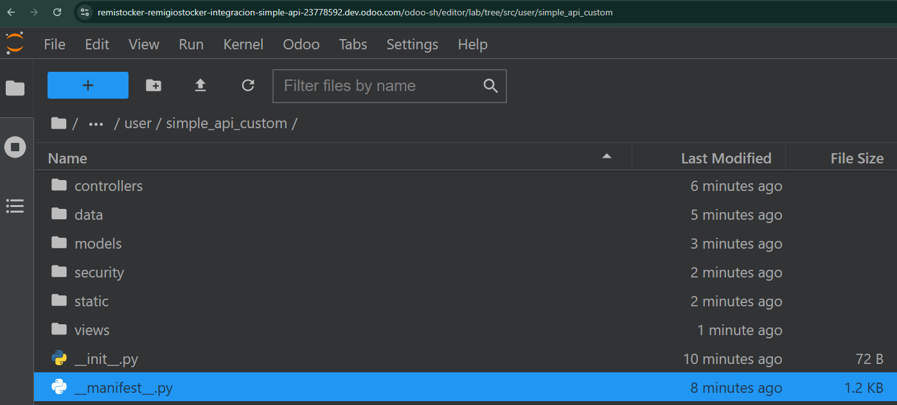 

---

### Código base

https://github.com/VaniaBurgosM/bhe-respaldo-onboarding.git

---

#### `src/user/simple_api_custom/controllers/__init__.py`

```python
# -*- coding: utf-8 -*-

from . import main

```

---

#### `src/user/simple_api_custom/controllers/main.py`

```python
import base64
from odoo import http
from odoo.http import request

class BoletaHonorariosController(http.Controller):
    @http.route('/boleta_honorarios/webhook', type='json', auth='none', methods=['POST'], csrf=False)
    def webhook_simpleapi(self, **kwargs):
        data = request.jsonrequest
        return {'status': 'ok'}

    @http.route('/boleta_honorarios/download/<int:boleta_id>', type='http', auth='user')
    def download_pdf(self, boleta_id, **kwargs):
        boleta = request.env['boleta.honorarios'].browse(boleta_id)
        if not boleta.exists() or not boleta.pdf_file:
            return request.not_found()
        return request.make_response(
            base64.b64decode(boleta.pdf_file),
            headers=[
                ('Content-Type', 'application/pdf'),
                ('Content-Disposition', f'inline; filename="{boleta.pdf_filename or "boleta.pdf"}"'),
            ]
        )

    # Opcional: expone anulación vía ruta interna
    @http.route('/boleta_honorarios/anular/<int:boleta_id>/<motivo>', type='json', auth='user', methods=['POST'], csrf=False)
    def anular_boleta_api(self, boleta_id, motivo, **kwargs):
        rec = request.env['boleta.honorarios'].browse(boleta_id).sudo()
        rec.motivo_anulacion = motivo
        rec.action_anular_boleta_path()
        return {'status': 'ok', 'state': rec.state, 'folio': rec.numero_boleta}
```

---

#### `src/user/simple_api_custom/data/ir_cron_data.xml`

```xml
<?xml version="1.0" encoding="utf-8"?>
<odoo>
    <data noupdate="1">
        <!-- Cron para descargar PDFs pendientes -->
        <record id="ir_cron_download_pending_pdfs" model="ir.cron">
            <field name="name">Descargar PDFs Pendientes - Boletas Honorarios</field>
            <field name="model_id" ref="model_boleta_honorarios"/>
            <field name="state">code</field>
            <field name="code">model.cron_download_pending_pdfs()</field>
            <field name="interval_number">15</field>
            <field name="interval_type">minutes</field>
            <field name="numbercall">-1</field>
            <field name="active" eval="True"/>
        </record>
    </data>
</odoo>
```

---

#### `src/user/simple_api_custom/models/__init__.py`

```python
# -*- coding: utf-8 -*-

from . import boleta_honorarios
from . import res_config_settings
```

---

#### `src/user/simple_api_custom/models/boleta_honorarios.py`

```python
# -*- coding: utf-8 -*-
import requests
import json
import base64
import time
from odoo import models, fields, api, _
from odoo.exceptions import UserError, ValidationError
import logging

_logger = logging.getLogger(__name__)

def _mask_key(key: str, show_start: int = 6, show_end: int = 4) -> str:
    """
    Enmascara una API Key, dejando ver los primeros y últimos caracteres.
    Evita exponer secretos completos en logs en producción.
    """
    try:
        if not key:
            return ''
        ks = str(key)
        if len(ks) <= show_start + show_end:
            return '*' * len(ks)
        return f"{ks[:show_start]}{'*' * 6}{ks[-show_end:]}"
    except Exception:
        return '******'

class BoletaHonorarios(models.Model):
    _name = 'boleta.honorarios'
    _description = 'Boleta de Honorarios SimpleAPI'
    _order = 'fecha_emision desc'
    _rec_name = 'numero_boleta'
    _inherit = ['mail.thread', 'mail.activity.mixin']

    # Campos básicos
    numero_boleta = fields.Char('Número de Boleta', readonly=True, tracking=True)
    fecha_emision = fields.Date('Fecha Emisión', default=fields.Date.today, required=True, tracking=True)
    state = fields.Selection([
        ('draft', 'Borrador'),
        ('processing', 'Procesando'),
        ('emitted', 'Emitida'),
        ('downloaded', 'Descargada'),
        ('error', 'Error'),
        ('cancelled', 'Anulada')
    ], string='Estado', default='draft', tracking=True)

    # Datos del emisor
    rut_usuario = fields.Char('RUT Usuario', required=True, help='RUT del usuario que emite la boleta')
    password_sii = fields.Char('Password SII', required=True, help='Contraseña del SII')
    direccion_emisor = fields.Selection([
        ('0', 'Dirección Principal'),
        ('1', 'Dirección Secundaria')
    ], string='Dirección Emisor', default='0', required=True)

    # Configuración de retención
    retencion = fields.Selection([
        ('0', 'Sin Retención'),
        ('1', 'Con Retención (10%)')
    ], string='Retención', default='1', required=True)

    # Datos del receptor
    partner_id = fields.Many2one('res.partner', string='Receptor', tracking=True)
    receptor_rut = fields.Char('RUT Receptor', required=True, tracking=True)
    receptor_nombre = fields.Char('Nombre Receptor', required=True, tracking=True)
    receptor_direccion = fields.Text('Dirección Receptor', required=True)
    receptor_region = fields.Selection([
        ('1', 'Tarapacá'), ('2', 'Antofagasta'), ('3', 'Atacama'), ('4', 'Coquimbo'),
        ('5', 'Valparaíso'), ('6', "O'Higgins"), ('7', 'Maule'), ('8', 'Biobío'),
        ('9', 'Araucanía'), ('10', 'Los Lagos'), ('11', 'Aysén'), ('12', 'Magallanes'),
        ('13', 'Metropolitana'), ('14', 'Los Ríos'), ('15', 'Arica y Parinacota'), ('16', 'Ñuble')
    ], string='Región Receptor', default='13', required=True)
    receptor_comuna = fields.Char('Comuna Receptor', required=True)

    # Detalles de la prestación
    descripcion_servicio = fields.Text('Descripción del Servicio', required=True)
    valor_bruto = fields.Monetary('Valor Bruto', required=True, currency_field='currency_id', tracking=True)
    currency_id = fields.Many2one('res.currency', string='Moneda', default=lambda self: self.env.company.currency_id)

    # Respuesta y archivo
    response_data = fields.Text('Respuesta API')
    pdf_file = fields.Binary('Archivo PDF', attachment=True)
    pdf_filename = fields.Char('Nombre Archivo PDF')

    # Envío por correo
    email_destinatario = fields.Char('Correo destinatario', help='Correo al que se enviará la boleta al emitir')

    # Seguimiento
    error_message = fields.Text('Mensaje de Error')
    fecha_procesamiento = fields.Datetime('Fecha Procesamiento')
    intentos = fields.Integer('Intentos', default=0)

    # Motivo de anulación para endpoint con path params
    motivo_anulacion = fields.Selection([
        ('1', '1: No se efectuó el pago'),
        ('2', '2: No se efectuó la prestación'),
        ('3', '3: Error en la digitación'),
    ], string='Motivo de anulación', help='Motivo exigido por el endpoint de anulación')

    @api.onchange('partner_id')
    def _onchange_partner_id(self):
        if self.partner_id:
            partner = self.partner_id
            self.receptor_rut = partner.vat or ''
            self.receptor_nombre = partner.name or ''
            self.receptor_direccion = partner.street or ''
            if partner.state_id:
                region_mapping = {'Santiago': '13', 'Valparaíso': '5', 'Concepción': '8'}
                self.receptor_region = region_mapping.get(partner.state_id.name, '13')
            if partner.city:
                self.receptor_comuna = partner.city
            if not self.email_destinatario and partner.email:
                self.email_destinatario = partner.email

    @api.onchange('receptor_rut', 'receptor_nombre')
    def _onchange_receptor_data(self):
        if self.receptor_rut and not self.partner_id:
            partner = self.env['res.partner'].search([('vat', '=', self.receptor_rut)], limit=1)
            if partner:
                self.partner_id = partner
                self._onchange_partner_id()

    @api.model
    def get_simpleapi_config(self):
        config = self.env['ir.config_parameter'].sudo()
        api_key = config.get_param('boleta_honorarios.simpleapi_api_key', '4648-N330-6392-2590-9354')
        base_url = config.get_param('boleta_honorarios.simpleapi_base_url', 'https://servicios.simpleapi.cl/api')
        timeout = int(config.get_param('boleta_honorarios.simpleapi_timeout', '30'))
        _logger.info(f"[BHE] Config SimpleAPI base_url={base_url} api_key={_mask_key(api_key)} timeout={timeout}")
        return {
            'api_key': api_key,
            'base_url': base_url,
            'timeout': timeout
        }  # [1][3]

    def action_emitir_boleta(self):
        for record in self:
            try:
                record.state = 'processing'
                record.intentos += 1
                record.fecha_procesamiento = fields.Datetime.now()
                record.message_post(body="Iniciando emisión de boleta de honorarios...")
                if not record.descripcion_servicio:
                    raise UserError(_('Debe agregar una descripción del servicio'))
                if record.valor_bruto <= 0:
                    raise UserError(_('El valor bruto debe ser mayor a cero'))
                if not record.email_destinatario or '@' not in record.email_destinatario:
                    raise UserError(_('Debe indicar un correo destinatario válido (ej: correo@dominio.cl)'))
                data = record._prepare_api_data()
                response = record._call_simpleapi(data)
                if response.get('success') or response.get('numeroDocumento') or response.get('numero') or response.get('folio'):
                    record._process_successful_response(response)
                else:
                    record._process_error_response(response)
            except Exception as e:
                _logger.error(f"Error emitiendo boleta {record.id}: {str(e)}")
                record.state = 'error'
                record.error_message = str(e)
                record.message_post(body=f"Error emitiendo boleta: {str(e)}", message_type='comment')

    def _prepare_api_data(self):
        self.ensure_one()
        return {
            'RutUsuario': self.rut_usuario.replace('.', '').replace('-', ''),
            'PasswordSII': self.password_sii,
            'Retencion': int(self.retencion),
            'FechaEmision': self.fecha_emision.strftime('%d-%m-%Y'),
            'Emisor': {'Direccion': self.direccion_emisor},
            'Receptor': {
                'Rut': self.receptor_rut.replace('.', '').replace('-', ''),
                'Nombre': self.receptor_nombre,
                'Direccion': self.receptor_direccion,
                'Region': int(self.receptor_region),
                'Comuna': self.receptor_comuna
            },
            'Detalles': [{'Nombre': self.descripcion_servicio, 'Valor': int(self.valor_bruto)}]
        }  # [3]

    def _call_simpleapi(self, data):
        config = self.get_simpleapi_config()
        try:
            headers = {
                'Content-Type': 'application/json',
                'Accept': 'application/json',
                'Authorization': config['api_key']
            }
            url = f"{config['base_url']}/bhe/emitir"
            _logger.info(f"🚀 [BHE] POST emitir -> {url} key={_mask_key(headers['Authorization'])}")
            resp = requests.post(url, json=data, headers=headers, timeout=config['timeout'])
            _logger.info(f"[BHE] emitir status={resp.status_code} body={resp.text[:300]}")
            if resp.status_code == 200:
                return resp.json()
            raise UserError(_(f"Error en API: {resp.status_code} - {resp.text}"))
        except UserError:
            raise
        except Exception as e:
            raise UserError(_(f"Error inesperado llamando SimpleAPI: {str(e)}"))  # [1][3]

    def _send_mail_via_simpleapi(self, folio: str, anio: int, email: str, wait_seconds: int = 1):
        self.ensure_one()
        if wait_seconds:
            time.sleep(wait_seconds)
        config = self.get_simpleapi_config()
        url = f"{config['base_url']}/bhe/mail/{folio}/{anio}"
        headers = {
            'Authorization': config['api_key'],
            'Accept': 'application/json',
            'Content-Type': 'application/json',
            'User-Agent': 'odoo-18-bhe'
        }
        payload = {
            'RutUsuario': self.rut_usuario.replace('.', '').replace('-', ''),
            'PasswordSII': self.password_sii,
            'Correo': email
        }
        _logger.info(f"✉️ [BHE] POST mail {url} key={_mask_key(headers['Authorization'])} -> {payload}")
        resp = requests.post(url, json=payload, headers=headers, timeout=config['timeout'])
        _logger.info(f"Mail status={resp.status_code} ct={resp.headers.get('Content-Type')} body={resp.text[:300]}")
        if resp.status_code in (200, 202):
            self.message_post(body=f"Correo solicitado a SimpleAPI (folio {folio}): {email}", message_type='notification')
            return True
        self.message_post(
            body=f"No se pudo solicitar envío por correo (POST). Status {resp.status_code}. Body: {resp.text[:300]}",
            message_type='comment'
        )
        return False  # [3]

    def _process_successful_response(self, response):
        self.ensure_one()
        self.response_data = json.dumps(response, indent=2)
        folio = (response.get('folio') or response.get('numeroDocumento') or
                 response.get('numero_boleta') or response.get('numeroBoleta') or response.get('numero'))
        if folio:
            self.numero_boleta = str(folio)
            self.state = 'emitted'
            self.error_message = False
            self.message_post(body=f"Boleta emitida exitosamente. Número: {self.numero_boleta}", message_type='notification')
            # Año de emisión
            anio = None
            for k in ('anio', 'anioFolio', 'year', 'anio_emision', 'anioFolioEmitido'):
                if response.get(k):
                    try:
                        anio = int(str(response.get(k))[:4]); break
                    except Exception:
                        pass
            if not anio and self.fecha_emision:
                anio = fields.Date.from_string(self.fecha_emision).year
            # Enviar por correo
            if anio and self.email_destinatario:
                try:
                    self._send_mail_via_simpleapi(self.numero_boleta, anio, self.email_destinatario, wait_seconds=1)
                except Exception as e:
                    _logger.exception(f"Fallo envío de correo por SimpleAPI: {e}")
                    self.message_post(body=f"Error solicitando envío por correo: {e}", message_type='comment')
        else:
            self.state = 'error'
            self.error_message = "Respuesta exitosa pero sin número de boleta"
            self.message_post(body=f"Respuesta exitosa sin folio. Response: {self.response_data}", message_type='comment')  # [3]

    def _process_error_response(self, response):
        self.ensure_one()
        self.state = 'error'
        error_msg = (response.get('error') or response.get('mensaje') or response.get('message') or
                     response.get('descripcion') or response.get('detalle') or 'Error desconocido')
        self.error_message = error_msg
        self.response_data = json.dumps(response, indent=2)
        self.message_post(body=f"Error en emisión: {error_msg}", message_type='comment')  # [3]

    # Se remueven descargas/cron del viewer
    def _schedule_pdf_download(self):
        return

    def action_download_pdf(self):
        return

    # LEGACY: anulación sin path (se conserva y se robustece)
    def action_anular_boleta(self):
        for record in self:
            if record.state not in ['emitted', 'downloaded']:
                raise UserError(_('Solo se pueden anular boletas emitidas'))
            try:
                config = record.get_simpleapi_config()
                headers = {
                    'Content-Type': 'application/json',
                    'Accept': 'application/json',
                    'Authorization': config['api_key']
                }
                data = {
                    'numeroDocumento': record.numero_boleta,
                    'rutEmisor': record.rut_usuario.replace('.', '').replace('-', ''),
                    'passwordSII': record.password_sii
                }
                url = f"{config['base_url']}/bhe/anular"
                _logger.info(f"[BHE] POST legacy {url} key={_mask_key(headers['Authorization'])}")
                resp = requests.post(url, json=data, headers=headers, timeout=config['timeout'])
                body_preview = resp.text[:300] if hasattr(resp, 'text') else str(resp)[:300]
                if resp.status_code == 200:
                    ok = False
                    try:
                        j = resp.json()
                        if isinstance(j, dict) and not j.get('error'):
                            ok = True
                    except Exception:
                        txt = (resp.text or '').lower()
                        ok = 'anulada' in txt or 'correctamente' in txt
                    if ok:
                        record.state = 'cancelled'
                        record.message_post(body=f"Boleta {record.numero_boleta} anulada exitosamente (legacy). Resp: {body_preview}",
                                            message_type='notification')
                        continue
                raise UserError(_('Error anulando boleta: %s') % body_preview)
            except Exception as e:
                raise UserError(_('Error anulando boleta: %s') % str(e))  # [4][3]

    # NUEVO: Anulación con {folio}/{motivo} y body con credenciales, manejando texto plano
    def action_anular_boleta_path(self):
        for record in self:
            if record.state not in ['emitted', 'downloaded']:
                raise UserError(_('Solo se pueden anular boletas emitidas o descargadas'))
            if not record.numero_boleta:
                raise UserError(_('No existe folio para anular'))
            if record.motivo_anulacion not in ('1', '2', '3'):
                raise UserError(_('Debe seleccionar un motivo válido (1, 2 o 3)'))
            try:
                config = record.get_simpleapi_config()
                headers = {
                    'Content-Type': 'application/json',
                    'Accept': 'application/json',
                    'Authorization': config['api_key'],
                    'User-Agent': 'odoo-18-bhe'
                }
                folio = str(record.numero_boleta).strip()
                motivo = record.motivo_anulacion
                url = f"{config['base_url']}/bhe/anular/{folio}/{motivo}"
                payload = {
                    "RutUsuario": record.rut_usuario.replace('.', '').replace('-', ''),
                    "PasswordSII": record.password_sii
                }
                _logger.info(f"🧻 [BHE] POST {url} key={_mask_key(headers['Authorization'])} -> body={{'RutUsuario':'***','PasswordSII':'***'}}")
                resp = requests.post(url, json=payload, headers=headers, timeout=config['timeout'])
                body_preview = resp.text[:300] if hasattr(resp, 'text') else str(resp)[:300]
                _logger.info(f"[BHE] Anular status={resp.status_code} body={body_preview}")

                if resp.status_code in (200, 202):
                    # Intentar JSON
                    data = None
                    try:
                        data = resp.json()
                    except Exception:
                        data = None

                    if isinstance(data, dict):
                        success_flag = str(data.get('success', 'true')).lower() in ('true', '1', 'yes')
                        has_error = bool(data.get('error'))
                        if success_flag and not has_error:
                            record.state = 'cancelled'
                            record.message_post(
                                body=f"Boleta {folio} anulada exitosamente (motivo {motivo}). Resp: {data}",
                                message_type='notification'
                            )
                            continue
                        raise UserError(_('Error anulando boleta: %s') % (data.get('error') or data))
                    else:
                        # Texto plano
                        txt = (resp.text or '').strip()
                        if txt and ('anulada' in txt.lower() or 'correctamente' in txt.lower()):
                            record.state = 'cancelled'
                            record.message_post(
                                body=f"Boleta {folio} anulada exitosamente (motivo {motivo}). Resp: {txt}",
                                message_type='notification'
                            )
                            continue
                        # 200 sin JSON ni palabra clave: marcar cancelado pero dejar evidencia
                        record.state = 'cancelled'
                        record.message_post(
                            body=f"Boleta {folio} anulada (HTTP {resp.status_code}) sin JSON; cuerpo: {txt[:300]}",
                            message_type='notification'
                        )
                        continue

                # Status distinto de 200/202
                raise UserError(_('Error anulando boleta: %s - %s') % (resp.status_code, body_preview))
            except UserError:
                raise
            except Exception as e:
                _logger.warning(f"[BHE] Error inesperado anulando boleta {record.numero_boleta}: {e}")
                raise UserError(_('Error inesperado anulando boleta: %s') % str(e))  # [4][3]

    @api.model
    def cron_download_pending_pdfs(self):
        return

    @api.constrains('valor_bruto')
    def _check_valor_bruto(self):
        for rec in self:
            if rec.valor_bruto <= 0:
                raise ValidationError(_('El valor bruto debe ser mayor a cero'))

    @api.constrains('rut_usuario')
    def _check_rut_usuario(self):
        for rec in self:
            if rec.rut_usuario and not self._validate_rut(rec.rut_usuario):
                raise ValidationError(_('El RUT del usuario no es válido'))

    @api.constrains('receptor_rut')
    def _check_receptor_rut(self):
        for rec in self:
            if rec.receptor_rut and not self._validate_rut(rec.receptor_rut):
                raise ValidationError(_('El RUT del receptor no es válido'))

    def _validate_rut(self, rut):
        if not rut:
            return False
        rut = rut.replace('.', '').replace('-', '').upper()
        if len(rut) < 8:
            return False
        numero, dv = rut[:-1], rut[-1]
        if not numero.isdigit():
            return False
        suma, mult = 0, 2
        for d in reversed(numero):
            suma += int(d) * mult
            mult = mult + 1 if mult < 7 else 2
        resto = suma % 11
        dv_calc = '0' if resto == 0 else 'K' if resto == 1 else str(11 - resto)
        return dv == dv_calc
```

---

#### `src/user/simple_api_custom/models/res_config_settings.py`

```python
from odoo import fields, models

class ResConfigSettings(models.TransientModel):
    _inherit = 'res.config.settings'
    
    simpleapi_api_key = fields.Char(
        string='SimpleAPI Key',
        config_parameter='boleta_honorarios.simpleapi_api_key',
        default='4648-N330-6392-2590-9354',
        help='API Key proporcionada por SimpleAPI'
    )
    
    simpleapi_base_url = fields.Char(
        string='SimpleAPI Base URL',
        config_parameter='boleta_honorarios.simpleapi_base_url',
        default='https://servicios.simpleapi.cl/api',
        help='URL base de la API de SimpleAPI'
    )
    
    simpleapi_timeout = fields.Integer(
        string='Timeout (segundos)',
        config_parameter='boleta_honorarios.simpleapi_timeout',
        default=30,
        help='Tiempo límite para las peticiones HTTP'
    )
```

---

#### `src/user/simple_api_custom/security/ir.model.access.csv`

```xml
id,name,model_id:id,group_id:id,perm_read,perm_write,perm_create,perm_unlink
access_boleta_honorarios_user,boleta.honorarios.user,model_boleta_honorarios,base.group_user,1,1,1,1

```

---

#### `src/user/simple_api_custom/static/description/icon.png`

---

#### `src/user/simple_api_custom/static/src/js/preview_iframe.js`

```javascript
/** @odoo-module */

import { registry } from "@web/core/registry";
import { formView } from "@web/views/form/form_view";

const patchIframePreview = {
    setup() {
        this._super(...arguments);
        // nada extra aquí
    },
    onWillStart() {
        if (super.onWillStart) return super.onWillStart(...arguments);
    },
    onMounted() {
        if (super.onMounted) super.onMounted(...arguments);
        this._setIframeSrc();
    },
    onWillUpdateProps(nextProps) {
        if (super.onWillUpdateProps) super.onWillUpdateProps(nextProps);
        // cuando cambian props (por ejemplo, cambia pdf_file/pdf_preview_url), reintenta setear
        queueMicrotask(() => this._setIframeSrc());
    },
    _setIframeSrc() {
        try {
            const iframe = this.el.querySelector("iframe.bhe_pdf_iframe");
            if (!iframe) return;
            const record = this.props && this.props.record;
            // En OWL form renderer, valores accesibles en record.data
            const url = record && record.data && record.data.pdf_preview_url;
            if (url && iframe.getAttribute("src") !== url) {
                iframe.setAttribute("src", url);
            }
        } catch (e) {
            // silencioso
            // console.warn("bhe iframe set error", e);
        }
    },
};

// Registrar un patch de la vista form por modelo específico
registry.category("views").add("boleta_honorarios_form_with_iframe", {
    ...formView,
    Controller: class extends formView.Controller {
        setup() {
            super.setup();
            Object.assign(this, patchIframePreview);
            if (this.onMounted) this.onMounted = patchIframePreview.onMounted.bind(this);
            if (this.onWillUpdateProps) this.onWillUpdateProps = patchIframePreview.onWillUpdateProps.bind(this);
            this._setIframeSrc = patchIframePreview._setIframeSrc.bind(this);
        }
    },
});
```

---

#### `src/user/simple_api_custom/views/assets.xml`

```xml
<?xml version="1.0" encoding="utf-8"?>
<odoo>
  <template id="bhe_assets_backend" name="BHE Assets" inherit_id="web.assets_backend">
    <xpath expr="." position="inside">
      <script type="module" src="/boleta_honorarios/static/src/js/preview_iframe.js"/>
    </xpath>
  </template>
</odoo>
```

---

#### `src/user/simple_api_custom/views/boleta_honorarios_views.xml`

```xml
<?xml version="1.0" encoding="utf-8"?>
<odoo>
  <record id="view_boleta_honorarios_form" model="ir.ui.view">
    <field name="name">boleta.honorarios.form</field>
    <field name="model">boleta.honorarios</field>
    <field name="arch" type="xml">
      <form string="Boleta de Honorarios">
        <header>
          <button name="action_emitir_boleta" string="Emitir Boleta" type="object" class="btn-primary"/>
          <!-- Botón legacy opcional -->
          <button name="action_anular_boleta" string="Anular (legacy)" type="object" class="btn-secondary"
                  confirm="¿Está seguro de anular esta boleta (legacy)?"/>
          <button name="action_anular_boleta_path" string="Anular por folio" type="object" class="btn-danger"
                  confirm="Se anulará la boleta en SII vía SimpleAPI usando el motivo seleccionado. ¿Continuar?"/>
          <field name="state" widget="statusbar" statusbar_visible="draft,processing,emitted,downloaded,cancelled,error"/>
        </header>
        <sheet>
          <group>
            <group string="Información General">
              <field name="numero_boleta"/>
              <field name="fecha_emision"/>
              <field name="currency_id" invisible="1"/>
            </group>
            <group string="Estado">
              <field name="fecha_procesamiento"/>
              <field name="intentos"/>
            </group>
          </group>

          <group string="Datos del Usuario Emisor">
            <field name="rut_usuario" placeholder="12345678-9"/>
            <field name="password_sii" password="True"/>
            <field name="direccion_emisor"/>
            <field name="retencion"/>
          </group>

          <group string="Datos del Receptor">
            <group>
              <field name="partner_id" options="{'no_create': True}" placeholder="Seleccionar receptor existente (opcional)"/>
              <field name="receptor_rut" placeholder="12345678-9" required="1"/>
              <field name="receptor_nombre" placeholder="Nombre completo del receptor" required="1"/>
            </group>
            <group>
              <field name="receptor_direccion" placeholder="Dirección completa del receptor"/>
              <field name="receptor_region"/>
              <field name="receptor_comuna" placeholder="Comuna del receptor"/>
            </group>
          </group>

          <group string="Detalles de la Prestación">
            <field name="descripcion_servicio" placeholder="Descripción detallada del servicio prestado"/>
            <field name="valor_bruto" widget="monetary"/>
          </group>

          <group string="Envío por correo">
            <field name="email_destinatario" placeholder="correo@dominio.cl" widget="email" required="1"/>
          </group>

          <!-- Apartado de Anulación sin attrs problemáticos -->
          <group string="Anulación">
            <group>
              <field name="motivo_anulacion"/>
            </group>
            <span>Para anular, seleccione el motivo y presione 'Anular por folio'. La acción validará el estado y el folio.</span>
          </group>

          <notebook>
            <page string="Respuesta API">
              <field name="response_data" widget="text" readonly="1"/>
            </page>
            <page string="Errores">
              <field name="error_message" readonly="1"/>
            </page>
          </notebook>
        </sheet>
        <div class="oe_chatter">
          <field name="message_follower_ids"/>
          <field name="activity_ids"/>
          <field name="message_ids"/>
        </div>
      </form>
    </field>
  </record>

  <record id="view_boleta_honorarios_list" model="ir.ui.view">
    <field name="name">boleta.honorarios.list</field>
    <field name="model">boleta.honorarios</field>
    <field name="arch" type="xml">
      <list string="Boletas de Honorarios"
            decoration-success="state == 'downloaded'"
            decoration-warning="state == 'processing'"
            decoration-danger="state == 'error'"
            decoration-info="state == 'draft'">
        <field name="numero_boleta"/>
        <field name="fecha_emision"/>
        <field name="partner_id"/>
        <field name="receptor_nombre"/>
        <field name="valor_bruto" widget="monetary"/>
        <field name="email_destinatario"/>
        <field name="state" widget="badge"/>
        <field name="fecha_procesamiento"/>
      </list>
    </field>
  </record>

  <record id="action_boleta_honorarios" model="ir.actions.act_window">
    <field name="name">Boletas de Honorarios</field>
    <field name="res_model">boleta.honorarios</field>
    <field name="view_mode">list,form</field>
  </record>

  <menuitem id="menu_boleta_honorarios_root" name="Boletas Honorarios" sequence="50"/>
  <menuitem id="menu_boleta_honorarios" name="Boletas de Honorarios"
            parent="menu_boleta_honorarios_root" action="action_boleta_honorarios" sequence="10"/>
</odoo>
```

---

#### `src/user/simple_api_custom/views/res_config_settings_views.xml`

```xml
<?xml version="1.0" encoding="utf-8"?>
<odoo>
    <record id="res_config_settings_view_form" model="ir.ui.view">
        <field name="name">res.config.settings.view.form.inherit.boleta.honorarios</field>
        <field name="model">res.config.settings</field>
        <field name="inherit_id" ref="base.res_config_settings_view_form"/>
        <field name="arch" type="xml">
            <xpath expr="//form" position="inside">
                <app data-string="Boletas Honorarios" string="Boletas Honorarios" name="boleta_honorarios_settings">
                    <block title="Configuración SimpleAPI">
                        <setting help="Configurar conexión con SimpleAPI Chile">
                            <div class="content-group">
                                <div class="row mt16">
                                    <label for="simpleapi_api_key" class="col-lg-3 o_light_label"/>
                                    <field name="simpleapi_api_key" placeholder="4648-N330-6392-2590-9354"/>
                                </div>
                                <div class="row">
                                    <label for="simpleapi_base_url" class="col-lg-3 o_light_label"/>
                                    <field name="simpleapi_base_url"/>
                                </div>
                                <div class="row">
                                    <label for="simpleapi_timeout" class="col-lg-3 o_light_label"/>
                                    <field name="simpleapi_timeout"/>
                                </div>
                            </div>
                        </setting>
                    </block>
                </app>
            </xpath>
        </field>
    </record>
</odoo>
```

---

#### `src/user/simple_api_custom/__init__.py`

```python
# -*- coding: utf-8 -*-

from . import controllers
from . import models
```

---

#### `src/user/simple_api_custom/__manifest__.py`

```python
# -*- coding: utf-8 -*-
{
    'name': 'Boletas de Honorarios SimpleAPI',
    'version': '18.0.1.0.0',
    'category': 'Accounting/Localization',
    'summary': 'Integración con SimpleAPI para emisión automática de boletas de honorarios',
    'description': """
        Módulo para la creación y autodescarga de boletas de honorarios
        mediante integración con SimpleAPI Chile.
        
        Características:
        - Emisión automática de boletas de honorarios
        - Descarga automática de PDF
        - Integración directa con SII Chile
        - Gestión de estados y seguimiento
    """,
    'author': 'Tu Empresa',
    'website': 'https://www.tuempresa.com',
    'license': 'LGPL-3',
    'depends': ['base', 'account', 'contacts', 'mail','web'],
    'data': [
        'security/ir.model.access.csv',
        'views/boleta_honorarios_views.xml',
        'views/res_config_settings_views.xml',
        #'data/ir_cron_data.xml',
        
    ],
    'assets': {
        'web.assets_backend': [
            #'boleta_honorarios_simpleapi/static/src/js/preview_iframe.js',
        ],
    },
    'installable': True,
    'auto_install': False,
    'application': True,
}
```

---

Debemos asegurarnos que las aplicaciones del archivo `simple_api_custom/__manifest__.py` en la línea `depends` se encuentran instalada en el entorno

```python
'depends': ['base', 'account', 'contacts', 'mail','web'],
```

Activamos el modo `debug` en `settings`:

https://remistocker-remigiostocker-integracion-simple-api-23778592.dev.odoo.com/odoo/settings?`debug=1`

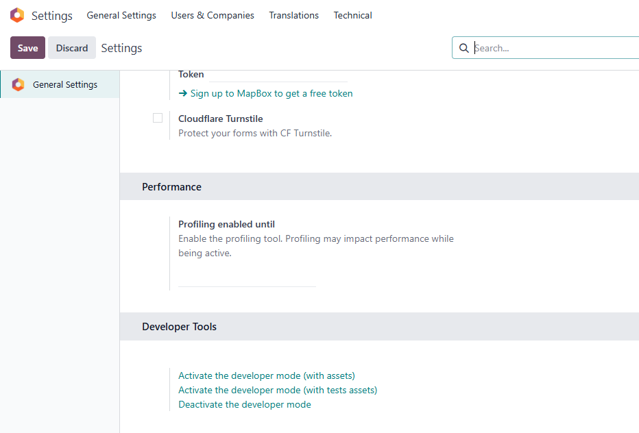


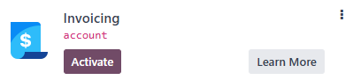

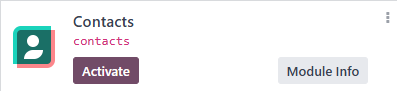

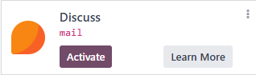

### Dashboard con las Apps previas 

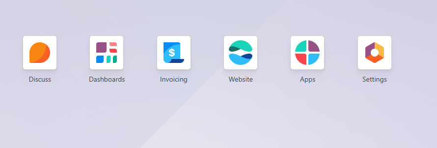

Ahora si podemos seguir, a grandes rasgos estos son los pasos a seguir:

```bash
git add .

git commit -m "feat: Agregar módulo base simple_api_custom"

git push origin integracion_simple_api
```

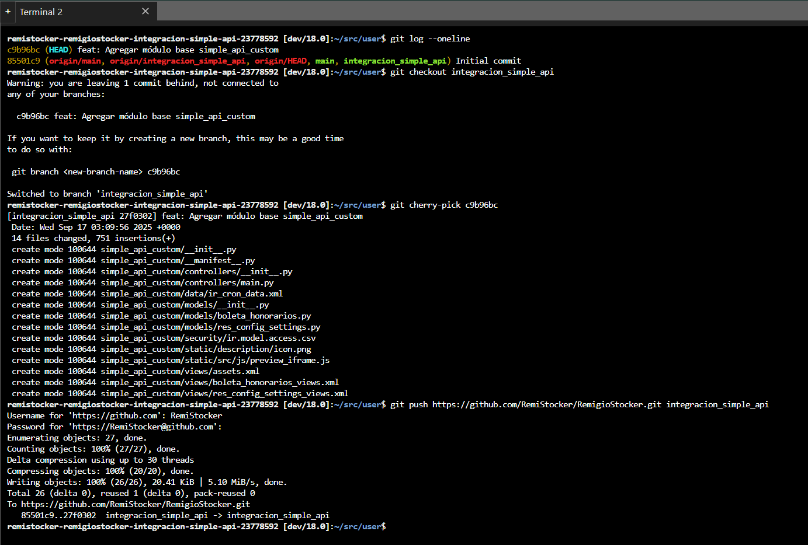

Tuve que hacer un checkout porque antes me había arrojado error, no estaba sobre ninguna rama, por lo que no pude pushear nada, luego el commit de interés lo elegí con cherry-pick y despues pushear, lo siguiente fue autenticar con el usuario de github y el token agregado en github.

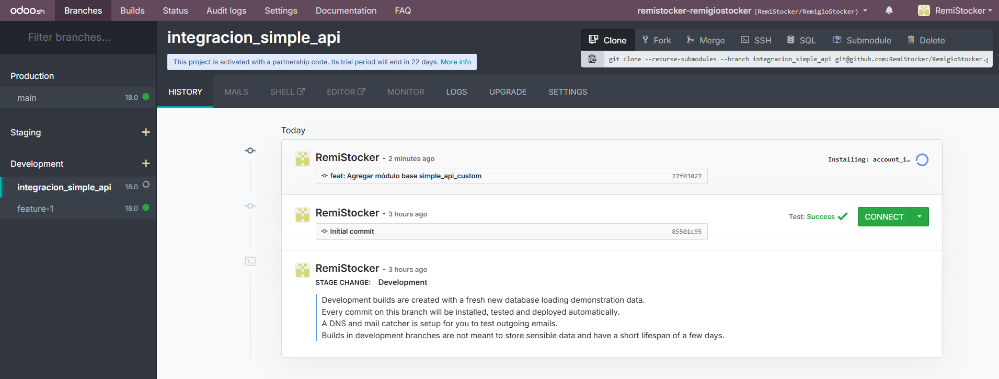

### 1er Build

---

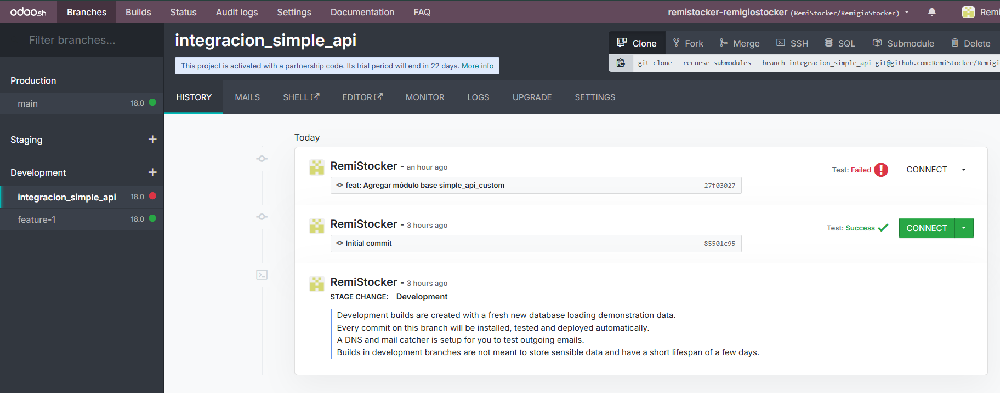

---

#### Error

Falló el buildeo, por lo que se revisaran los logs

El problema es una **dependencia no satisfecha**. La línea clave del log es esta:

```bash
Exception: module simple_api_custom: Unmet dependencies: boleta_honorarios_settings
```

Quiere decir que el módulo `simple_api_custom` le está diciendo a Odoo que necesita que otro módulo llamado `boleta_honorarios_settings` esté instalado para poder funcionar. Pero ese módulo no existe.

El error se origina en el archivo de vistas para la configuración.

`views/res_config_settings_views.xml`

```python
<app data-string="Boletas Honorarios" string="Boletas Honorarios" name="boleta_honorarios_settings">
```

El atributo `name` en la etiqueta `<app>` dentro de una vista de configuración **debe ser el nombre técnico de un módulo que ya existe**. Se usa para que Odoo sepa bajo qué aplicación agrupar estos ajustes. El código actual intenta agregar los ajustes a una aplicación inexistente llamada `boleta_honorarios_settings`.

---

#### Solución

Para solucionarlo debemos cambiar el valor del atributo `name` por el nombre técnico del nuestro propio módulo, que es `simple_api_custom`.

Debemos cambiar el valor del atributo `name` por el nombre técnico del propio módulo, que es `simple_api_custom`.

1. Abrimos el archivo `views/res_config_settings_views.xml` en el Editor de Odoo.sh.

   

2. Buscamos la línea mencionada y reemplazamos por esta:

   XML

   ```
   <app data-string="Boletas Honorarios" string="Boletas Honorarios" name="simple_api_custom">
   ```

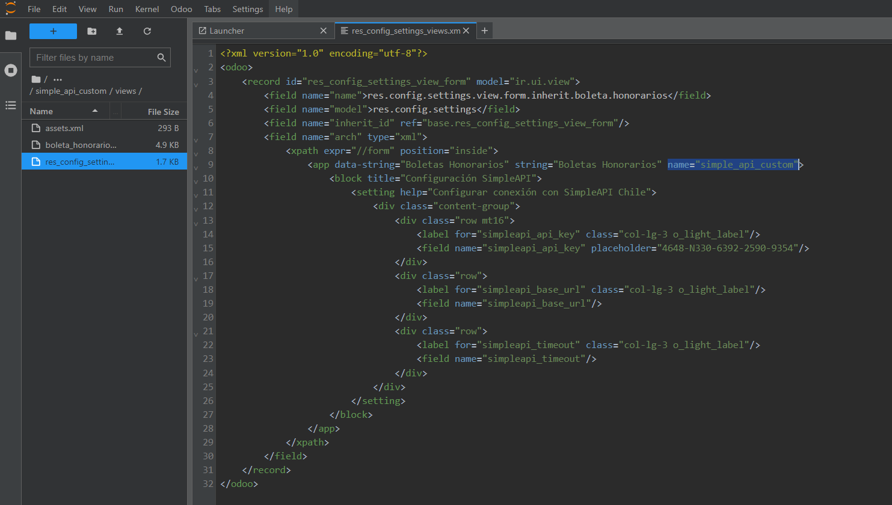

1. **Guarda** el cambio en el archivo.

   

2. Vamos a la **Shell** y ejecutamos los siguientes comandos para subir la corrección:

   ```bash
   git add views/res_config_settings_views.xml
   
   git commit -m "fix: Corregir dependencia en la vista de configuración"
   
   git push https://github.com/RemiStocker/RemigioStocker.git integracion_simple_api
   ```

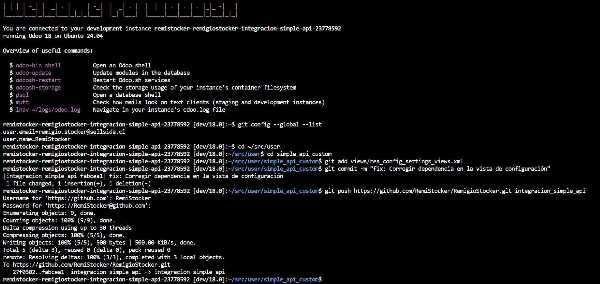

Después de hacer este `push`, Odoo.sh creará un nuevo build. Esta vez, la instalación debería ser exitosa y deberías poder ver el botón verde "CONNECT".

---

### 2do Build

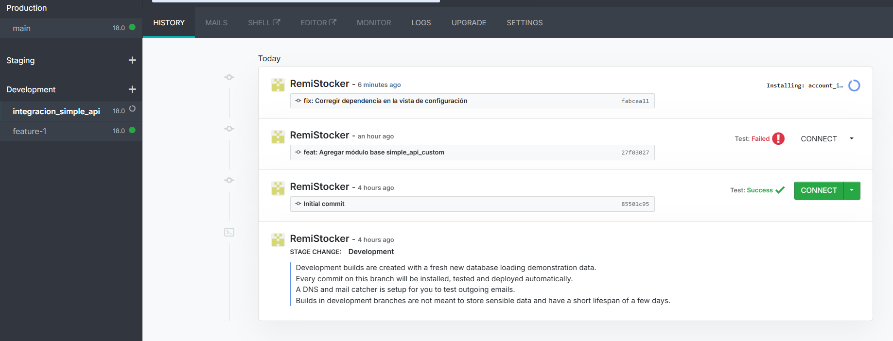

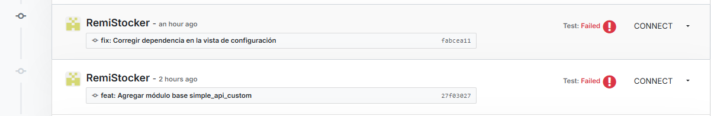

---

#### Error

El problema es una violación de restricción en la base de datos. La línea clave del log de pruebas es:

> ```
> psycopg2.errors.NotNullViolation: null value in column "currency_id" of relation "boleta_honorarios" violates not-null constraint
> ```

Una de las pruebas automáticas está intentando crear una "Boleta de Honorarios" para verificar que todo funciona, pero al intentar guardarla en la base de datos, el campo de la **moneda (`currency_id`)** está vacío. La base de datos tiene una regla estricta que dice que ese campo es **obligatorio** y no puede estar vacío.

En el código tenemos un campo monetario, `valor_bruto`, que es obligatorio. 

En Odoo, todo campo monetario debe estar asociado a un campo de moneda (`currency_id`), lo que convierte a `currency_id` en un campo implícitamente obligatorio.

Aunque ya tenemos un valor por defecto en el modelo, el entorno de pruebas automáticas de Odoo.sh a veces no lo asigna a tiempo, causando el fallo.

---

#### Solución

La solución es hacer que el campo `currency_id` sea explícitamente obligatorio en el modelo. Esto fuerza a que el valor por defecto se aplique de manera más robusta en todos los contextos.

1. Abrimos el archivo **`models/boleta_honorarios.py`** en el Editor de Odoo.sh.

   

2. Buscamos la definición del campo `currency_id`. Actualmente se ve así:

   Python

   ```python
   # LÍNEA ACTUAL
   currency_id = fields.Many2one('res.currency', string='Moneda', default=lambda self: self.env.company.currency_id)
   ```

3. Modificamos para añadir `required=True`:

   ```python
   # LÍNEA CORREGIDA
   currency_id = fields.Many2one(
       'res.currency', 
       string='Moneda', 
       default=lambda self: self.env.company.currency_id,
       required=True  # <-- 
   )
   ```

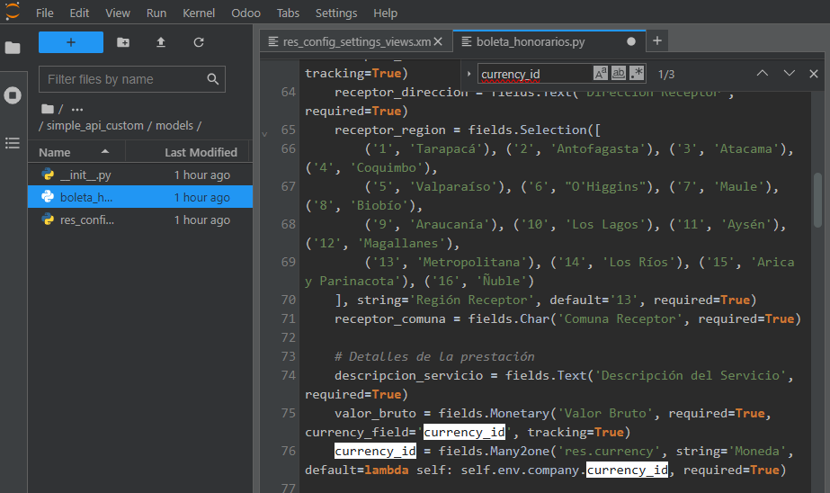

1. **Guarda**mos el cambio en el archivo `models/boleta_honorarios.py`.

   

2. Vamos a la **Shell** y pusheamos:

   ```bash
   git add models/boleta_honorarios.py
   
   git commit -m "fix: Hacer currency_id un campo obligatorio"
   
   git push https://github.com/RemiStocker/RemigioStocker.git integracion_simple_api
   ```

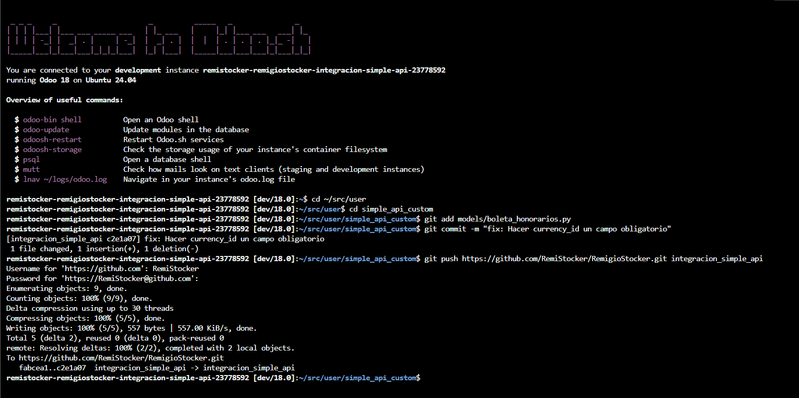

---

### Resultado exitoso

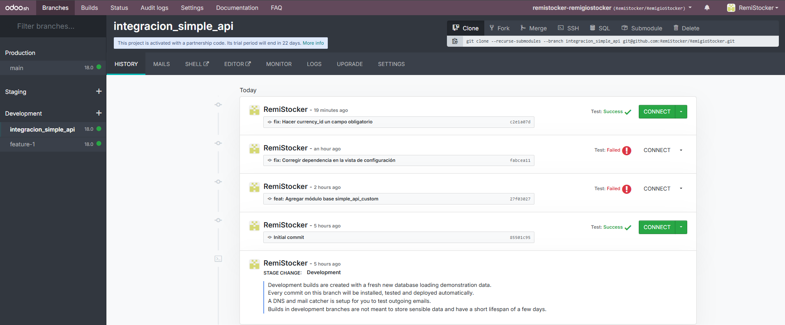

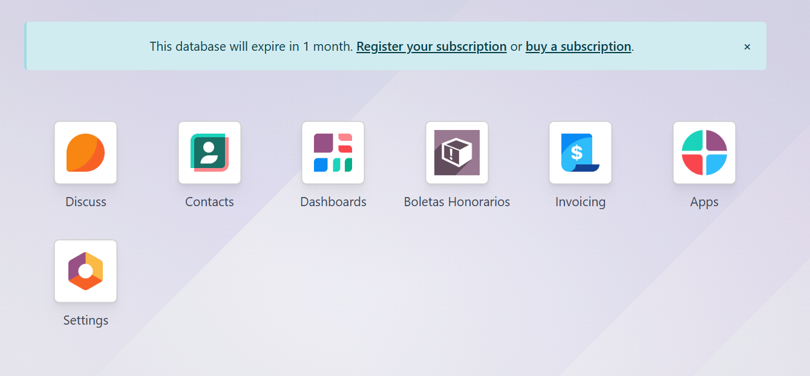

Hasta aquí ya tenemos la **Fase 1: Preparar el módulo** de la documentación

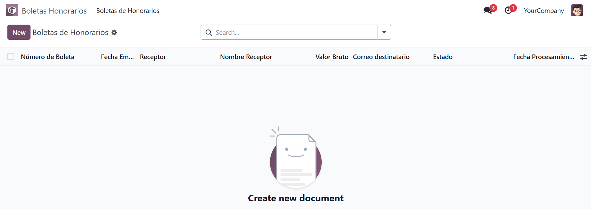

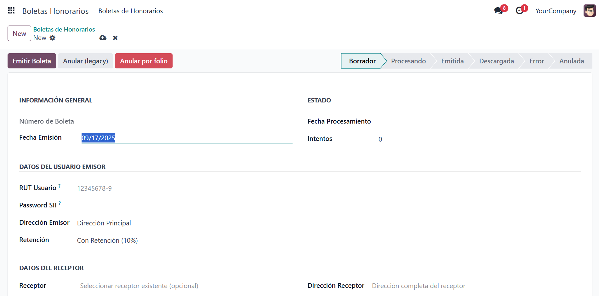

---

---

---

# Fase 2: Agregar endpoints

## Asignar una cuenta para conseguir un plan gratuito en Simple API 

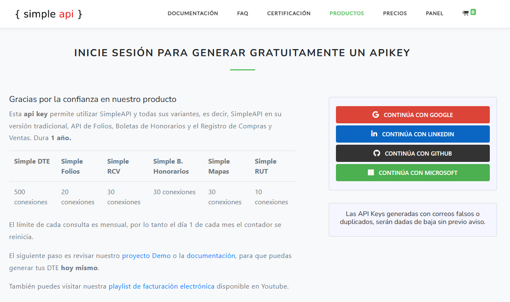

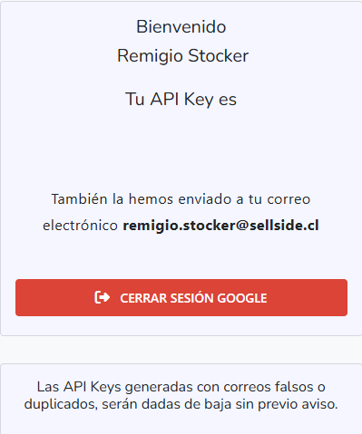

## 2.1.- Ir a[ Simple API](https://documentacion.simpleapi.cl/#1aaa51cd-bc0a-46e9-99d3-7c8ca8215d03) y elegir 1 de los siguientes endpoints

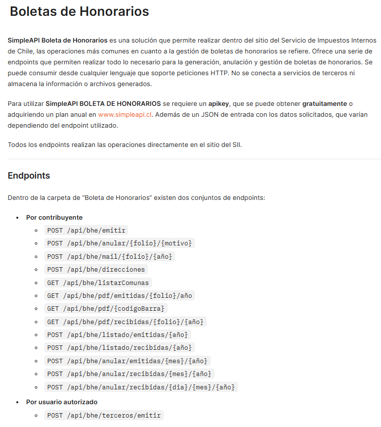

```json
**Por contribuyente

POST /api/bhe/emitir

POST /api/bhe/anular/{folio}/{motivo}

POST /api/bhe/mail/{folio}/{año}

POST /api/bhe/direcciones

GET /api/bhe/listarComunas

GET /api/bhe/pdf/emitidas/{folio}/año

GET /api/bhe/pdf/{codigoBarra}

GET /api/bhe/pdf/recibidas/{folio}/{año}

POST /api/bhe/listado/emitidas/{año}

POST /api/bhe/listado/recibidas/{año}

POST /api/bhe/anular/emitidas/{mes}/{año}

POST /api/bhe/anular/recibidas/{mes}/{año}

POST /api/bhe/anular/recibidas/{dia}/{mes}/{año}

---

**Por usuario autorizado

POST /api/bhe/terceros/emitir
```

---

### Emitir Boleta de Honorarios por API

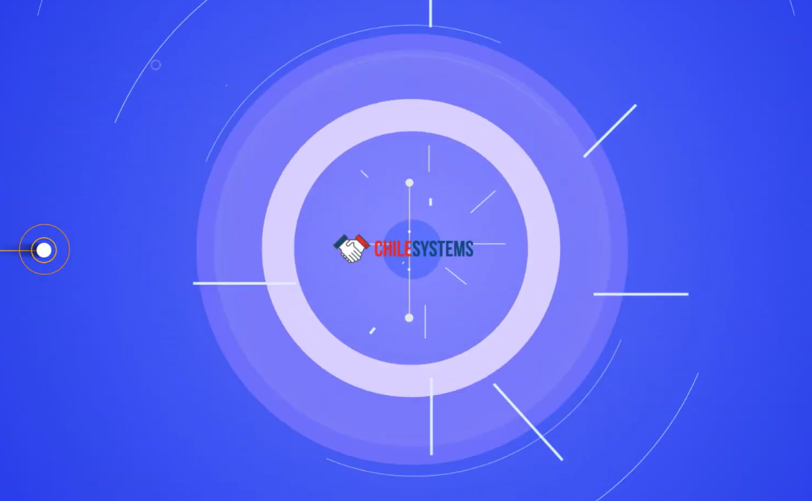

https://www.youtube.com/watch?v=VIHJIqgAyPM&t=43s
